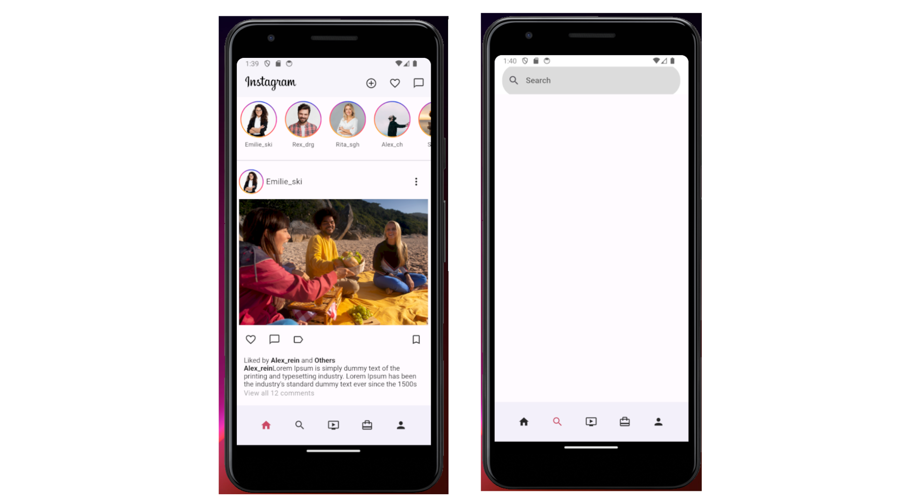
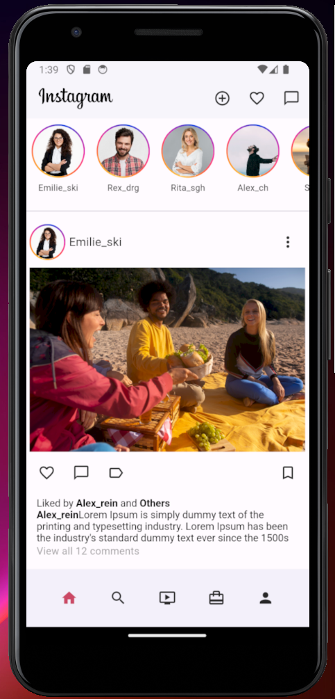
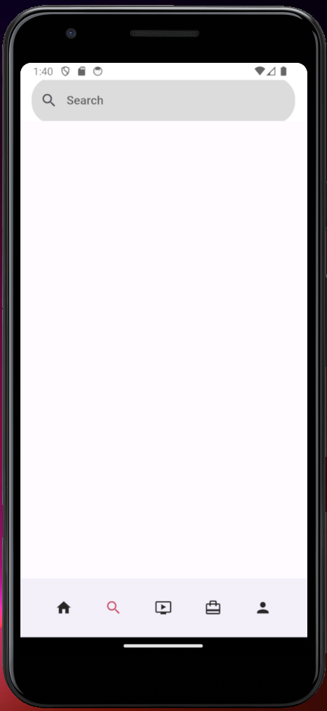

# Instagram Clone - Home and Search Pages in Flutter



## Description

I developed a clone of the Instagram mobile application using Flutter, focusing on the **Home** and **Search** pages. This project highlights:

- **Home Page**: A vertically scrollable feed implemented with `ListView.builder` for smooth rendering.
- **Search Page**: Horizontally scrollable content, also built with `ListView.builder`.
- **Pull-to-Refresh**: Added functionality using `RefreshIndicator`.
- **Dynamic Header**: Implemented a `SliverAppBar` that expands and collapses based on user interactions.

This project showcases my ability to recreate modern social media app interfaces with responsive and interactive UI elements.

## Features

- **Responsive UI**: The app adapts seamlessly to different screen sizes.
- **Efficient Rendering**: Smooth scrolling and efficient loading using `ListView.builder`.
- **Interactive Header**: A flexible `SliverAppBar` for an enhanced user experience.
- **Pull-to-Refresh**: Easy content refresh with a pull gesture.

## Screenshot




## Tech Stack

- **Flutter**: Dart-based cross-platform framework.
- **Widgets Used**:
  - `ListView.builder`
  - `RefreshIndicator`
  - `SliverAppBar`

## How to Run

1. Clone the repository:
   ```bash
   git clone https://github.com/ChebbiYahya/Instagram-Clone.git

2. Navigate to the project directory
    ```bash
    cd instagram-clone

3. Install dependencies:
    ```bash
    flutter pub get

4. Run the app:
    ```bash
    flutter run
